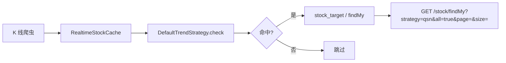

# 单边趋势策略（qsn · v1.0）

> 版本：v1.0 · 2026-06  
> 状态：**已实现**  
> 对应小程序 Tab：`trend`（单边趋势）  
> 对应后端枚举：`StrategyTypeEnum.TREND_NEW`（code = `qsn`）  
> 策略类：`DefaultTrendStrategy`

---

## 1. 产品定义

**一句话**：大周期已多头或刚转多，价格沿趋势方向运行，当前节点仍值得顺势跟踪。

| 决策 | 结论 |
|------|------|
| 主形态 | **趋势延续（模式 B）** 为主 |
| 补充 | **月 K 拐点（模式 A）** 作补充 |
| 列表规模 | **不限**，全量进池，按 **score 降序 + 分页** |
| 与 multi 边界 | **不使用** 梯子 / 双波段（留给 `cross_band_pressure`） |

小程序文案对齐：**梯子试盘 · 均线多头 · 突破延续**

---

## 2. 总体判定

```
命中 = Gate 通过  AND  (模式 B 完整  OR  模式 B 环境  OR  模式 A)
排序 = score（越高越靠前）
展示档位 = S / A / B / C（仅标签，不截断列表）
```

| 模式 | 条件 | 档位 |
|------|------|------|
| **B 完整** | 周 Context ≥ 2/3 **且** 日 Trigger ≥ 1 | A（共振则 S） |
| **B 环境** | 周 Context ≥ 2/3 **且** 日 Trigger = 0 | B |
| **A 拐点** | 月 K 双条件（见 §5） | C（与 B 共振则 S） |

---

## 3. Gate（硬门槛）

| # | 条件 | 实现 |
|---|------|------|
| G1 | 在 `filterStockMap` 内（非 ST、可交易等） | 扫描入口过滤 |
| G2 | 流动性：近 6 日平均成交额 > 5000 万 | `PriorityTools.checkBaseAmountPriority` |
| G3 | **周 K 或 月 K** 至少一个：未跌破近端支撑 Low | `RiskTools.checkNotUnderLowRisk` |

---

## 4. 模式 B — 趋势延续（主路径）

### 4.1 Context（周 K 为主，至少 2/3）

| 代号 | 条件 | 工具 |
|------|------|------|
| B-C1 | 周 K 收盘 > MA20 | `IndicatorCommonUtils.checkOverMA20(WEEK)` |
| B-C2 | 周 K MA5 > MA20 | `IndicatorCommonUtils.checkMA5OverMA20(WEEK)` |
| B-C3 | 周 K 收盘 ≥ 前一周 Low | `IndicatorCommonUtils.checkOverLastLow(WEEK)` |

**月 K 加分（计分用，非必须）**

| 代号 | 条件 |
|------|------|
| B-C4 | 月 K 收盘 > MA20 |
| B-C5 | 月 K 阳线 **或** 收盘 ≥ 上月 Low |

### 4.2 Trigger（日 K，至少 1 项）

| 代号 | 条件 |
|------|------|
| B-T1 | 日 K 阳线，且收盘突破近 **8** 根日 K 平台 High |
| B-T2 | 日 K 收盘 > MA5，且前一日非强阳（实体涨幅 ≤ 3%） |
| B-T3 | 日 K MACD 金叉 **或** MACD > 0 |

---

## 5. 模式 A — 月 K 拐点（补充）

K 线索引（`getLastTrade(stock, MONTH, offset)`）：

| 符号 | offset | 含义 |
|------|--------|------|
| K3 | 0 | 本月 |
| K2 | 1 | 上月 |
| K1 | 2 | 前第 2 根月 K |

**同时满足：**

1. K3 阳线：`K3.close > K3.open`，且 K2 非阳：`K2.close <= K2.open`
2. 突破 K1 实体下沿：`K3.close > K1.getShitiMin()`

信号文案：`月K阳反阴&突破前第2月实体下沿`

---

## 6. Score 与档位

### 6.1 分值

| 项 | 分值 |
|----|------|
| B-C1 ~ B-C3 各命中 | +10 |
| B-C4 / B-C5 | +8 / +5 |
| B-T1 / B-T2 / B-T3 | +15 / +12 / +10 |
| 模式 B 完整 | +20 |
| 模式 A | +15 |
| B 完整 + A 共振 | +25 |

### 6.2 档位（写入 `trendMessage` 前缀 `[S|A|B|C]`）

| 档位 | 条件 | 展示标签 |
|------|------|----------|
| **S** | B 完整 +（A 或 月 K 加分全中） | 趋势延续·共振 |
| **A** | B 完整 | 梯子试盘·均线多头 |
| **B** | B 环境（Context 够、Trigger 无） | 趋势环境·待确认 |
| **C** | 仅 A | 月K拐点·观察 |

---

## 7. 代码结构

```
strategy/tools/unilateral/
├── UnilateralGateTools.java          # Gate
├── UnilateralContinuationTools.java  # 模式 B
├── UnilateralPivotTools.java         # 模式 A
├── UnilateralScoreCalculator.java    # score + tier
└── UnilateralTrendEvaluator.java     # 编排入口

strategy/DefaultTrendStrategy.java    # override check()，不走 AbstractStrategy 默认四层
```

---

## 8. 触发与 API



- 手动扫描：`POST /tts/stock/admin/scan-strategy`
- 实时查询：`GET /tts/stock/findMy?strategy=qsn&all=true`（按 score 排序分页）

---

## 9. 与 multi 边界

| 维度 | 单边 qsn | 多周期 multi |
|------|----------|--------------|
| 核心 | 均线多头 + 日 K 延续/再起 | 波段/梯子关键位突破 |
| 工具 | MA、前 Low、日 K 平台 | Band、TiZi、双波段 |
| 不宜重叠 | 同一标的同时在两 Tab 高频出现需收紧 Trigger |

---

## 10. 变更记录

| 版本 | 日期 | 说明 |
|------|------|------|
| v0.1 | 2026-06 | 仅月 K 双条件，跳过 Gate/Trend |
| v1.0 | 2026-06 | Gate + 模式 B（主）+ 模式 A（补）+ score/档位；偏延续 |
| v1.1 | 2026-06 | 客户端可调参数 + API 透传 |
| v1.2 | 2026-06 | 客户端触发策略重跑（rescan） |

---

## 11. 客户端自定义参数

小程序首页「单边趋势」列表头 **⚙** 可调参数，保存于本地 storage，请求 `/stock/findMy` 时附带：

| 查询参数 | 说明 | 默认 |
|----------|------|------|
| `uDayLookback` | 日 K 平台回溯根数 | 8 |
| `uStrongYangPct` | 强阳阈值（%） | 3 |
| `uWeekContextMin` | 周 K 环境最少满足项 1-3 | 2 |
| `uMinAmountWan` | 最低日均成交额（万） | 5000 |
| `uEnableModeB` | 启用模式 B（1/0） | 1 |
| `uEnableModeA` | 启用模式 A（1/0） | 1 |
| `uEnableModeBWeak` | 含弱环境 B 档（1/0） | 1 |
| `uTierMin` | 最低档位 ALL/S/A/B/C | ALL |

实现：`atlas_wechat/utils/strategy-params.js` + `components/strategy-params-panel`

---

## 12. 策略重跑（rescan）

| 能力 | 说明 |
|------|------|
| **仅预览** | 参数面板「仅预览」→ `GET /stock/findMy` 带 `u*` 参数，实时评估，**不写库** |
| **应用并重跑** | 参数面板「应用并重跑」或列表头 **↻** → `POST /stock/strategy/rescan?strategy=qsn&u*=…`，全市场扫描写入 `stock_target`，清推荐缓存，再刷新列表 |
| **开关** | `atlas.strategy.rescan-enabled=true`（默认开启） |

响应示例：`{ "saved": 42, "strategy": "qsn" }`（`saved` 为当日写入/更新条数）

实现：`atlas_wechat/utils/stock-api.js` → `triggerStrategyRescan()`；后端 `StockBaseController#rescanStrategy`
